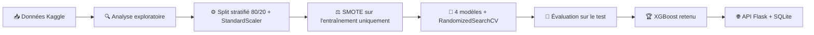

<div align="center">

# 🛡️ Détection de Fraude Bancaire

### Application web Flask & Machine Learning

*Prédiction en temps réel du risque de fraude par carte bancaire, sur des données extrêmement déséquilibrées.*

<br>


<br>

[📄 Rapport](report/) · [🎬 Démo vidéo](docs/demo/) · [📊 Résultats](#-résultats) · [🚀 Installation](#-installation-et-lancement) · [🔌 API](#-api-rest)

</div>

---

> **🇬🇧 EN —** Credit-card fraud detection web app (Flask + XGBoost). Four models compared on a highly imbalanced dataset (0.173 % fraud) using SMOTE and cross-validated hyperparameter search. Best model **XGBoost: ROC-AUC 0.982, F1 0.87**, served through a REST API with risk scoring (LOW / MEDIUM / HIGH) and SQLite prediction logging. Master's project (Advanced Python), Ibn Tofaïl University.

## ✨ Points clés

| | |
|---|---|
| 🎯 **Problème** | 492 fraudes sur 284 807 transactions (**0,173 %**) : l'accuracy seule est trompeuse |
| 🧪 **Approche** | SMOTE + 4 modèles comparés + `RandomizedSearchCV` (CV stratifiée à 5 plis) |
| 🏆 **Meilleur modèle** | **XGBoost** : ROC-AUC **0,982**, F1 **0,87**, 84 fraudes détectées sur 98 |
| 🌐 **Déploiement** | Application Flask, API REST, historique SQLite, dashboard administrateur |

## 📸 Aperçu de l'application

| 📝 Formulaire de saisie | ✅ Résultat d'une prédiction | 🛠️ Dashboard admin |
|:---:|:---:|:---:|
|  |  |  |

🎬 [Voir la vidéo de démonstration](docs/demo/video_app.mp4)

## 🗂️ Dataset

[**Credit Card Fraud Detection**](https://www.kaggle.com/datasets/mlg-ulb/creditcardfraud) (Kaggle, ULB) : transactions de cartes européennes sur 2 jours.

| Caractéristique | Valeur |
|---|---|
| 💳 Transactions | 284 807 |
| 🚨 Fraudes | 492 (**0,173 %**) |
| 🔢 Variables | `Time`, `Amount`, `V1`–`V28` (composantes PCA anonymisées), `Class` |
| ✂️ Découpage | 80 % / 20 % stratifié : 227 845 en entraînement, 56 962 en test (98 fraudes) |

> 📦 `creditcard.csv` (≈ 150 Mo) n'est pas inclus : voir [Installation](#-installation-et-lancement).

<p align="center">
  
  
</p>

Variables les plus discriminantes : `V14`, `V4`, `V11`, `V12`.

## 🧠 Méthodologie



| Étape | Détail |
|---|---|
| **Prétraitement** (`ml/preprocess.py`) | Séparation stratifiée, `StandardScaler` sur `Amount` et `Time` |
| **Rééquilibrage** | **SMOTE** (ratio 0,1, k = 5) appliqué **uniquement au train** pour éviter toute fuite vers le test |
| **Optimisation** (`ml/train.py`) | `RandomizedSearchCV`, 5 plis stratifiés, score F1 |
| **Déploiement** (`app/`) | *Application Factory* + *Blueprint*, modèle chargé une seule fois (`FraudDetector`) |

| Modèle | Type | Hyperparamètres optimisés |
|---|---|---|
| Logistic Regression | Supervisé | `C`, `penalty` (`class_weight='balanced'`) |
| Random Forest | Supervisé | `n_estimators`, `max_depth`, `min_samples` |
| **XGBoost** ⭐ | Supervisé | `learning_rate`, `max_depth`, `subsample`, `scale_pos_weight` |
| Isolation Forest | Non supervisé | Détection d'anomalies |

## 📊 Résultats

Évaluation sur 56 962 transactions de test (seuil 0,5).

| Modèle | Accuracy | Precision | Recall | F1-score | ROC-AUC |
|---|---:|---:|---:|---:|---:|
| 🥇 **XGBoost** | **0.9996** | **0.8842** | 0.8571 | **0.8705** | **0.9820** |
| 🥈 Random Forest | 0.9995 | 0.8710 | 0.8265 | 0.8482 | 0.9689 |
| 🥉 Logistic Regression | 0.9761 | 0.0622 | **0.9184** | 0.1166 | 0.9726 |
| Isolation Forest | 0.9975 | 0.2152 | 0.1735 | 0.1921 | 0.5862 |

<p align="center">
  
  
</p>

**Lecture des résultats**

- ✅ **XGBoost** détecte **84 fraudes sur 98** (14 manquées) pour seulement **11 faux positifs** sur 56 864 transactions légitimes.
- ⚠️ La **régression logistique** a le meilleur rappel (90/98) mais **1 356 faux positifs** : inutilisable en production. Son accuracy de 97,6 % illustre le piège de cette métrique.
- 📉 **Isolation Forest** reste proche du hasard (AUC 0,59) sur des variables déjà transformées par PCA.

## 🔌 API REST

| Méthode | Route | Description |
|---|---|---|
| `GET` | `/` | Formulaire de saisie |
| `POST` | `/predict` | Probabilité de fraude + niveau de risque (JSON ou formulaire) |
| `GET` | `/predict/<id>` | Résultat d'une prédiction précise |
| `GET` | `/stats` | Statistiques du modèle et des prédictions |
| `GET` | `/history` | 50 dernières prédictions |
| `GET` | `/admin` | Dashboard faux positifs / faux négatifs |

**Niveaux de risque** : 🟢 `LOW` · 🟠 `MEDIUM` · 🔴 `HIGH`

<details>
<summary><b>💻 Exemple d'appel</b></summary>

```bash
curl -X POST http://localhost:5000/predict \
  -H "Content-Type: application/json" \
  -d '{"Time": 406, "Amount": 149.62, "V1": -1.3598, "V2": -0.0728, "...": "V3 à V28"}'
```

```json
{
  "is_fraud": true,
  "fraud_probability": 0.923,
  "risk_level": "HIGH",
  "model_name": "XGBoost",
  "threshold": 0.5
}
```

</details>

## 🚀 Installation et lancement

Le modèle entraîné est **inclus** (`app/models/`) : pas besoin de ré-entraîner.

```bash
# 1. Cloner
git clone https://github.com/Bilal-Jellaoui/fraud-detection-flask-ml.git
cd fraud-detection-flask-ml

# 2. Environnement virtuel
python -m venv venv
venv\Scripts\activate            # Windows
# source venv/bin/activate       # Linux / macOS

# 3. Dépendances
pip install -r requirements.txt

# 4. Lancer
python run.py                    # → http://localhost:5000
```

<details>
<summary><b>🔁 Ré-entraîner le modèle (optionnel)</b></summary>

Télécharger `creditcard.csv` depuis [Kaggle](https://www.kaggle.com/datasets/mlg-ulb/creditcardfraud), le placer dans `data/`, puis :

```bash
python ml/train.py               # ≈ 50 à 75 min selon la machine
```

</details>

## 📁 Structure du dépôt

```
fraud-detection-flask-ml/
├── app/
│   ├── __init__.py              # Application Factory Flask
│   ├── routes.py                # Endpoints REST + modèle SQLAlchemy
│   ├── models/
│   │   ├── fraud_detector.py    # Wrapper du modèle ML
│   │   ├── saved_model.pkl      # XGBoost entraîné
│   │   ├── scaler.pkl           # StandardScaler (Amount, Time)
│   │   └── model_meta.json      # Métriques et métadonnées
│   └── templates/               # index.html, result.html
├── ml/
│   ├── preprocess.py            # Chargement, split, scaling, SMOTE
│   ├── train.py                 # Recherche d'hyperparamètres
│   └── evaluate.py              # Métriques, ROC/PR, matrices de confusion
├── notebooks/eda.ipynb          # Analyse exploratoire
├── data/                        # Figures (creditcard.csv à ajouter)
├── docs/                        # Captures d'écran et vidéo
├── report/                      # Rapport du projet (PDF + sources LaTeX)
├── run.py
└── requirements.txt
```

## ⚠️ Limites et pistes d'amélioration

| Limite | Piste |
|---|---|
| 📉 **Concept drift** : les schémas de fraude évoluent | Ré-entraînement périodique |
| 🔍 **Interprétabilité** limitée (`V1`–`V28` anonymisées par PCA) | Explicabilité **SHAP** |
| 🎚️ **Seuil de décision** : évaluation à 0,5, application à un seuil plus bas | Choisir le seuil selon le coût d'une fraude manquée vs un client bloqué |
| 🔐 **Prototype** : pas d'authentification sur l'API | Authentification, Docker, déploiement scalable |

## 🛠️ Compétences mises en œuvre


## 👤 Auteur

**Bilal Jellaoui** · [GitHub](https://github.com/Bilal-Jellaoui) · [LinkedIn](https://www.linkedin.com/in/bilal-jellaoui-381594170)

Master M1 Big Data, Intelligence Artificielle et Applications Avancées — Université Ibn Tofaïl, Faculté des Sciences de Kénitra · 2025–2026
Module : Python Avancé · Encadrant : Pr. Hatim Derrouz · [LinkedIn](https://www.linkedin.com/in/hatimderrouz/?isSelfProfile=false)

