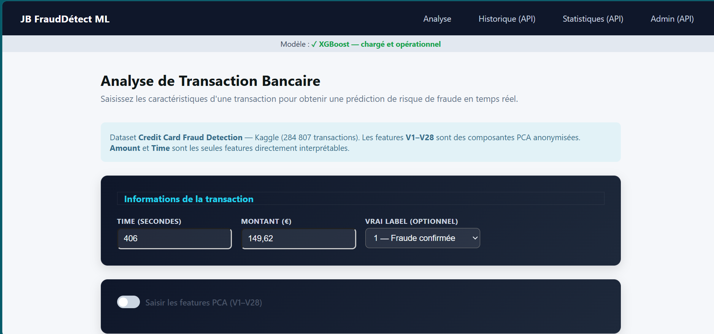
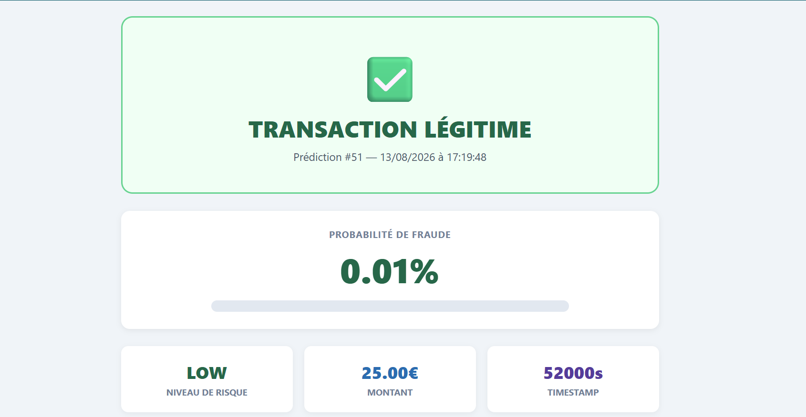
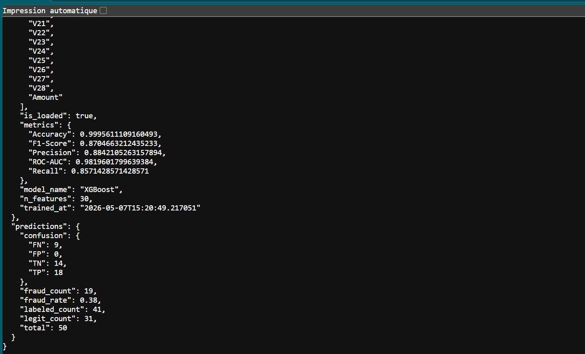
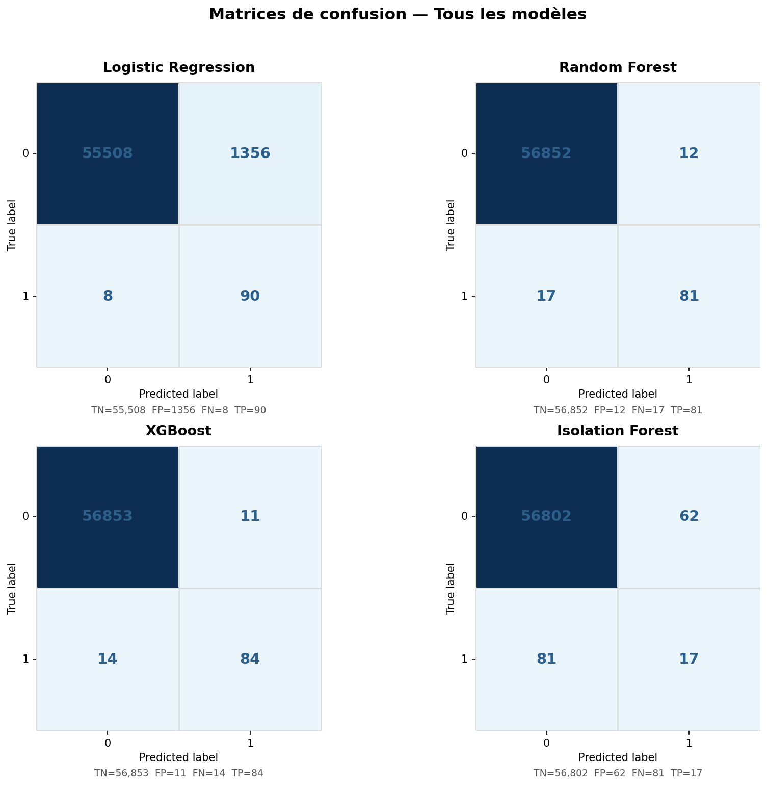
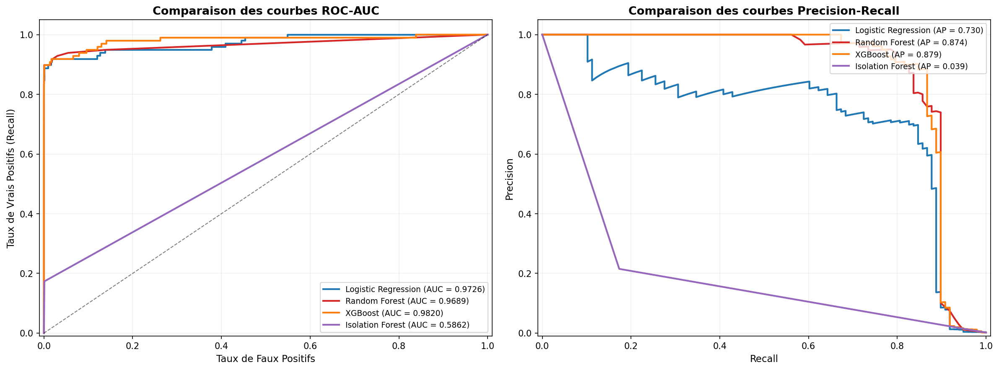
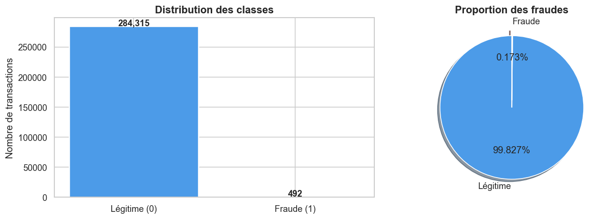
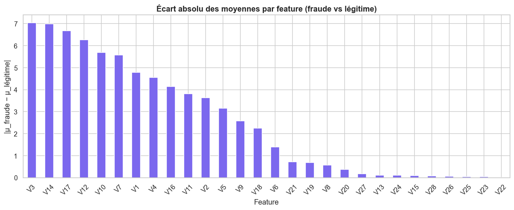

# 🛡️ Détection de fraude bancaire — Application web Flask & Machine Learning


> **EN —** Credit-card fraud detection web app (Flask + XGBoost). Four models compared on a highly imbalanced dataset (0.172 % fraud) using SMOTE and cross-validated hyperparameter search; best model **XGBoost: ROC-AUC 0.982, F1 0.87**, served through a REST API with risk scoring (LOW / MEDIUM / HIGH) and SQLite prediction logging. Master's project (Advanced Python), Ibn Tofaïl University.

Application web de **détection de fraude par carte bancaire** : un agent saisit les caractéristiques d'une transaction et obtient en temps réel une **probabilité de fraude** et un **niveau de risque**. Projet du module *Python Avancé* — Master M1 Big Data, IA & Applications Avancées (Université Ibn Tofaïl, Kénitra).

📄 **Rapport complet** : [`report/`](report/) · 🎬 **Vidéo de démonstration** : [`docs/demo/`](docs/demo/)

---

## 🎯 Objectifs

- Détecter automatiquement les transactions frauduleuses malgré un **déséquilibre extrême** des classes (492 fraudes sur 284 807 transactions).
- **Comparer** des modèles supervisés et non supervisé avec les bonnes métriques (précision, rappel, F1, ROC-AUC, matrice de confusion — l'accuracy seule serait trompeuse).
- **Déployer** le meilleur modèle dans une application Flask avec API REST, historique des prédictions et tableau de bord d'analyse des erreurs.

## 📸 Aperçu de l'application

| Formulaire de saisie | Résultat d'une prédiction | Dashboard admin |
|:---:|:---:|:---:|
|  |  |  |

🎬 [Voir la vidéo de démonstration](docs/demo/video_app.mp4)

## 🗂️ Dataset

[**Credit Card Fraud Detection** (Kaggle, ULB)](https://www.kaggle.com/datasets/mlg-ulb/creditcardfraud) — transactions de cartes européennes sur 2 jours.

| Caractéristique | Valeur |
|---|---|
| Transactions | 284 807 |
| Fraudes | 492 (**0,172 %**) |
| Variables | `Time`, `Amount`, `V1`–`V28` (composantes PCA anonymisées), `Class` |
| Découpage | 80 % / 20 % stratifié — 227 845 en entraînement, 56 962 en test |

> Le fichier `creditcard.csv` (≈ 150 Mo) n'est pas inclus dans le dépôt : voir [Installation](#-installation-et-lancement).

## 🧠 Méthodologie

**1. Analyse exploratoire** (`notebooks/eda.ipynb`) : distribution des classes, des montants et du temps, histogrammes des 28 composantes, corrélations avec la variable cible. Variables les plus discriminantes : `V14`, `V4`, `V11`, `V12`.

**2. Prétraitement** (`ml/preprocess.py`) : séparation stratifiée, normalisation de `Amount` et `Time` (`StandardScaler`), puis **SMOTE appliqué uniquement sur l'entraînement** (ratio fraudes/légitimes de 10 %) pour éviter toute fuite de données vers le test.

**3. Modélisation** (`ml/train.py`) : 4 modèles, optimisés par `RandomizedSearchCV` avec validation croisée stratifiée à 5 plis, en maximisant le **F1-score**.

| Modèle | Type | Hyperparamètres optimisés |
|---|---|---|
| Logistic Regression | Supervisé | `C`, `penalty` (`class_weight='balanced'`) |
| Random Forest | Supervisé | `n_estimators`, `max_depth`, `min_samples` |
| **XGBoost** | Supervisé | `learning_rate`, `max_depth`, `subsample`, `scale_pos_weight` |
| Isolation Forest | Non supervisé | Détection d'anomalies entraînée sur les transactions légitimes |

**4. Déploiement** (`app/`) : pattern *Application Factory* + *Blueprint*, modèle chargé une seule fois au démarrage (`FraudDetector`), prédictions journalisées en SQLite via SQLAlchemy.

## 📊 Résultats

| Modèle | Accuracy | Precision | Recall | F1-score | ROC-AUC |
|---|---:|---:|---:|---:|---:|
| **XGBoost ★** | **0.9996** | **0.8842** | 0.8571 | **0.8705** | **0.9820** |
| Random Forest | 0.9995 | 0.8710 | 0.8265 | 0.8482 | 0.9689 |
| Logistic Regression | 0.9761 | 0.0622 | **0.9184** | 0.1166 | 0.9726 |
| Isolation Forest | 0.9975 | 0.2152 | 0.1735 | 0.1921 | 0.5862 |

<p align="center">
  
  
</p>

**Lecture des résultats**
- **XGBoost** détecte **84 fraudes sur 98** (14 manquées) et ne génère que **11 faux positifs sur 56 864** transactions légitimes : le meilleur compromis entre fraudes détectées et clients légitimes bloqués.
- La **régression logistique** a le meilleur rappel (90 fraudes sur 98) mais **1 356 faux positifs** : inutilisable en production, car elle bloquerait massivement des clients légitimes. Cela illustre pourquoi l'accuracy (97,6 %) est une métrique trompeuse ici.
- **Isolation Forest** (non supervisé) reste proche du hasard (AUC 0,59) sur ces variables déjà transformées par PCA.

<p align="center">
  
  
</p>

## 🔌 API REST

| Méthode | Route | Description |
|---|---|---|
| `GET` | `/` | Formulaire de saisie |
| `POST` | `/predict` | Probabilité de fraude + niveau de risque (JSON ou formulaire) |
| `GET` | `/predict/<id>` | Résultat d'une prédiction précise |
| `GET` | `/stats` | Statistiques du modèle et des prédictions |
| `GET` | `/history` | 50 dernières prédictions |
| `GET` | `/admin` | Dashboard faux positifs / faux négatifs |

**Exemple**

```bash
curl -X POST http://localhost:5000/predict \
  -H "Content-Type: application/json" \
  -d '{"Time": 406, "Amount": 149.62, "V1": -1.3598, "V2": -0.0728, "...": "V3 à V28"}'
```

```json
{
  "is_fraud": true,
  "fraud_probability": 0.923,
  "risk_level": "HIGH",
  "model_name": "XGBoost",
  "threshold": 0.5
}
```

## 🚀 Installation et lancement

Le modèle entraîné est **inclus** (`app/models/`) : l'application se lance sans ré-entraîner.

```bash
# 1. Cloner
git clone https://github.com/Bilal-Jellaoui/fraud-detection-flask-ml.git
cd fraud-detection-flask-ml

# 2. Environnement virtuel
python -m venv venv
venv\Scripts\activate            # Windows
# source venv/bin/activate       # Linux / macOS

# 3. Dépendances
pip install -r requirements.txt

# 4. Lancer l'application
python run.py                    # → http://localhost:5000
```

**Ré-entraîner le modèle (optionnel)** : télécharger `creditcard.csv` depuis [Kaggle](https://www.kaggle.com/datasets/mlg-ulb/creditcardfraud), le placer dans `data/`, puis :

```bash
python ml/train.py               # ≈ 50 à 75 min selon la machine
```

## 📁 Structure du dépôt

```
fraud-detection-flask-ml/
├── app/
│   ├── __init__.py              # Application Factory Flask
│   ├── routes.py                # Endpoints REST + modèle SQLAlchemy
│   ├── models/
│   │   ├── fraud_detector.py    # Wrapper du modèle ML
│   │   ├── saved_model.pkl      # Modèle XGBoost entraîné
│   │   ├── scaler.pkl           # StandardScaler (Amount, Time)
│   │   └── model_meta.json      # Métriques et métadonnées
│   └── templates/               # index.html, result.html
├── ml/
│   ├── preprocess.py            # Chargement, split, scaling, SMOTE
│   ├── train.py                 # Recherche d'hyperparamètres, sauvegarde
│   └── evaluate.py              # Métriques, ROC/PR, matrices de confusion
├── notebooks/eda.ipynb          # Analyse exploratoire
├── data/                        # Figures d'analyse (creditcard.csv à ajouter)
├── docs/                        # Captures d'écran et vidéo de démonstration
├── report/                      # Rapport du projet (PDF)
├── run.py
└── requirements.txt
```

## ⚠️ Limites et pistes d'amélioration

- **Concept drift** : les schémas de fraude évoluent, le modèle devrait être ré-entraîné périodiquement.
- **Interprétabilité limitée** : les variables `V1`–`V28` sont anonymisées par PCA. Piste : explicabilité avec **SHAP**.
- **Prototype** : pas d'authentification sur l'API (non prête pour la production).
- **Pistes** : boucle de retour (`true_label`) pour le ré-entraînement continu, conteneurisation Docker, déploiement scalable.

## 🛠️ Compétences mises en œuvre

Machine Learning sur données déséquilibrées (SMOTE, class weights) · Optimisation d'hyperparamètres (RandomizedSearchCV, validation croisée) · Évaluation (precision / recall / F1 / ROC-AUC / matrice de confusion) · Flask (API REST, Blueprint, Application Factory) · SQLAlchemy / SQLite · Analyse exploratoire (pandas, seaborn) · Rédaction technique

## 👤 Auteur

**Bilal Jellaoui** · [GitHub](https://github.com/Bilal-Jellaoui) · [LinkedIn](https://www.linkedin.com/in/TON-PROFIL)

Master M1 Big Data, Intelligence Artificielle et Applications Avancées — Université Ibn Tofaïl, Faculté des Sciences de Kénitra · 2025–2026
Module : Python Avancé · Encadrant : Pr. Hatim Derrouz
